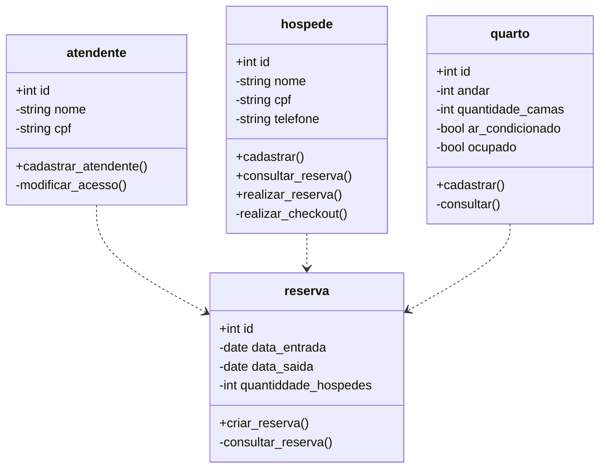

# Diagrama de classes:

```mermaid
classDiagram
    class atendente {
        +int id
        -string nome
        -string cpf
        +cadastrar_atendente()
        -modificar_acesso()
    }

    class hospede {
        +int id
        -string nome
        -string cpf
        -string telefone
        +cadastrar()
        +consultar_reserva()
        +realizar_reserva()
        -realizar_checkout()
    }

    class quarto {
        +int id
        -int andar
        -int quantidade_camas
        -bool ar_condicionado
        -bool ocupado
        +cadastrar()
        -consultar()
    }

    class reserva {
        +int id
        -date data_entrada
        -date data_saida
        -int quantiddade_hospedes
        +criar_reserva()
        -consultar_reserva()
    }
    
    atendente ..> reserva
    hospede ..> reserva
    quarto ..> reserva


```