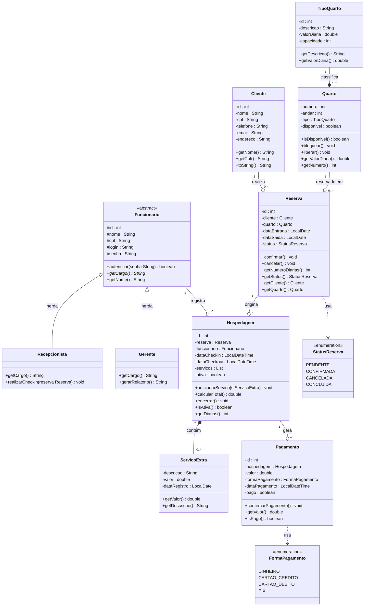

# Diagrama de classes:

```mermaid
classDiagram
    direction TB
 
    class Funcionario {
        <<abstract>>
        #id : int
        #nome : String
        #cpf : String
        #login : String
        #senha : String
        +autenticar(senha String) boolean
        +getCargo() String*
        +getNome() String
    }
 
    class Recepcionista {
        +getCargo() String
        +realizarCheckin(reserva Reserva) void
    }
 
    class Gerente {
        +getCargo() String
        +gerarRelatorio() String
    }
 
    class Cliente {
        -id : int
        -nome : String
        -cpf : String
        -telefone : String
        -email : String
        -endereco : String
        +getNome() String
        +getCpf() String
        +toString() String
    }
 
    class TipoQuarto {
        -id : int
        -descricao : String
        -valorDiaria : double
        -capacidade : int
        +getDescricao() String
        +getValorDiaria() double
    }
 
    class Quarto {
        -numero : int
        -andar : int
        -tipo : TipoQuarto
        -disponivel : boolean
        +isDisponivel() boolean
        +bloquear() void
        +liberar() void
        +getValorDiaria() double
        +getNumero() int
    }
 
    class Reserva {
        -id : int
        -cliente : Cliente
        -quarto : Quarto
        -dataEntrada : LocalDate
        -dataSaida : LocalDate
        -status : StatusReserva
        +confirmar() void
        +cancelar() void
        +getNumeroDiarias() int
        +getStatus() StatusReserva
        +getCliente() Cliente
        +getQuarto() Quarto
    }
 
    class Hospedagem {
        -id : int
        -reserva : Reserva
        -funcionario : Funcionario
        -dataCheckin : LocalDateTime
        -dataCheckout : LocalDateTime
        -servicos : List
        -ativa : boolean
        +adicionarServico(s ServicoExtra) void
        +calcularTotal() double
        +encerrar() void
        +isAtiva() boolean
        +getDiarias() int
    }
 
    class ServicoExtra {
        -descricao : String
        -valor : double
        -dataRegistro : LocalDate
        +getValor() double
        +getDescricao() String
    }
 
    class Pagamento {
        -id : int
        -hospedagem : Hospedagem
        -valor : double
        -formaPagamento : FormaPagamento
        -dataPagamento : LocalDateTime
        -pago : boolean
        +confirmarPagamento() void
        +getValor() double
        +isPago() boolean
    }
 
    class StatusReserva {
        <<enumeration>>
        PENDENTE
        CONFIRMADA
        CANCELADA
        CONCLUIDA
    }
 
    class FormaPagamento {
        <<enumeration>>
        DINHEIRO
        CARTAO_CREDITO
        CARTAO_DEBITO
        PIX
    }
 
    Funcionario <|-- Recepcionista : herda
    Funcionario <|-- Gerente : herda
    Cliente "1" --o "0..*" Reserva : realiza
    Quarto "1" --o "0..*" Reserva : reservado em
    TipoQuarto "1" --* "1..*" Quarto : classifica
    Reserva "1" --o "1" Hospedagem : origina
    Funcionario "1" --o "0..*" Hospedagem : registra
    Hospedagem "1" *-- "0..*" ServicoExtra : contém
    Hospedagem "1" --o "1" Pagamento : gera
    Reserva ..> StatusReserva : usa
    Pagamento ..> FormaPagamento : usa


```
