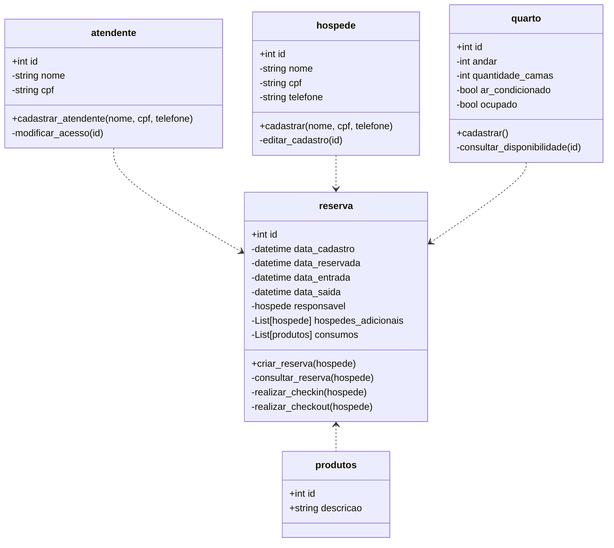

# Diagrama de classes:

```mermaid
classDiagram
    class atendente {
        +int id
        -string nome
        -string cpf
        +cadastrar_atendente(nome, cpf, telefone)
        -modificar_acesso(id)
    }

    class hospede {
        +int id
        -string nome
        -string cpf
        -string telefone
        +cadastrar(nome, cpf, telefone)
        -editar_cadastro(id)
    }

    class quarto {
        +int id
        -int andar
        -int quantidade_camas
        -bool ar_condicionado
        -bool ocupado

        +cadastrar()
        -consultar_disponibilidade(id)
    }

    class reserva {
        +int id
        -datetime data_cadastro
        -datetime data_reservada
        -datetime data_entrada
        -datetime data_saida
        -hospede responsavel
        -List[hospede] hospedes_adicionais
        -List[produtos] consumos
        +criar_reserva(hospede)
        -consultar_reserva(hospede)
        -realizar_checkin(hospede)
        -realizar_checkout(hospede)
    }

    class produtos{
        +int id
        +string descricao
    }
    
    atendente ..> reserva
    hospede ..> reserva
    quarto ..> reserva
    reserva <.. produtos


```