# Diagramas de Classes e Arquitetura do Sistema

Este documento apresenta a modelagem de classes e a arquitetura do **Sistema de Gestão de Hotelaria**. O sistema utiliza o padrão arquitetural **MVC (Model-View-Controller)** em Python, combinado com padrões de projeto comportamentais e estruturais avançados:
- **State Pattern**: Para o controle de ciclo de vida e gerenciamento de transição de estados dos quartos do hotel.
- **Repository Pattern**: Para desacoplar a camada de negócio da persistência de dados (através de interfaces `Protocol`).

---

## 1. Diagrama de Classes Geral (Mermaid)

```mermaid
classDiagram
    direction TB

    namespace Models_Domain {
        class Client {
            -_id : int | None
            -_nome : str
            -_cpf : str
            -_telefone : str
            -_email : str
            +get_id() int
            +set_id(id: int) void
            +get_nome() str
            +get_cpf() str
            +get_telefone() str
            +get_email() str
        }

        class Room {
            +TIPOS : list~str~
            -_numero : int
            -_tipo : str
            -_valor_diaria : float
            +estado : State_context
            +get_numero() int
            +get_tipo() str
            +get_valor_diaria() float
        }

        class Reservation {
            -_id : int | None
            -__guest : Client
            -__checkin : date
            -__checkout : date
            +guest : Client
            +checkin_date : date
            +checkout : date
        }

        class Guest_Stay {
            -_id : int | None
            -__guest : Client
            -__room_number : Room
            -__checkin_date : datetime
            -__checkout_date : datetime
            -__guest_bill : Guest_Bill
            +get_total() float
            +add_item(item: Bill_Item) void
        }

        class Item {
            -_id : int
            -__name : str
            -__price : float
            +id : int
            +name : str
            +price : float
        }

        class Bill_Item {
            -_id : int
            -__item : Item
            -__quantity : int
            +id : int
            +item : Item
            +quantity : int
        }

        class Guest_Bill {
            -_id_stay : int
            -__itens : list~Bill_Item~
            +add_itens(item: Bill_Item) void
            +calculate_total() float
        }
    }

    namespace Pattern_State {
        class State_context {
            -_state : State
            +set_estado(new_state: State) void
            +book(room: Room) void
            +check_in(room: Room) void
            +check_out(room: Room) void
            +start_maintenance(room: Room) void
            +end_maintenance(room: Room) void
            +finish_cleaning(room: Room) void
            +get_current() str
        }

        class State {
            <<abstract>>
            +book(room: Room)* void
            +check_in(room: Room)* void
            +check_out(room: Room)* void
            +start_maintenance(room: Room)* void
            +end_maintenance(room: Room)* void
            +finish_cleaning(room: Room)* void
            +get_current()* str
        }

        class Available {
            +book(room: Room) void
            +check_in(room: Room) void
            +start_maintenance(room: Room) void
            +get_current() str
        }

        class Reserved {
            +check_in(room: Room) void
            +get_current() str
        }

        class Ocupied {
            +check_out(room: Room) void
            +get_current() str
        }

        class Cleaning {
            +start_maintenance(room: Room) void
            +finish_cleaning(room: Room) void
            +get_current() str
        }

        class Maintenance {
            +end_maintenance(room: Room) void
            +get_current() str
        }
    }

    namespace Repositories {
        class Client_Repository {
            <<interface>>
            +save(cliente: Client)* void
            +delete(client_cpf: str)* bool
            +get_all()* list~Client~
            +find_by_id(id_query: int)* Client
            +find_by_Cpf(cpf_query: str)* Client
            +update(guest: Client)* bool
        }

        class In_Memory_Client_Repository {
            -_clients : list~Client~
            -__next_id : int
            +save(cliente: Client) void
            +delete(client_cpf: str) bool
            +get_all() list~Client~
            +find_by_id(id_query: int) Client
            +find_by_Cpf(cpf_query: str) Client
        }

        class Room_Repository {
            <<interface>>
            +add(quarto: Room)* void
            +delete(number_query: int)* bool
            +list()* list~Room~
            +find_by_number(number_query: int)* Room
            +get_types()* list~str~
        }

        class In_Memory_Room_Repository {
            -_quartos : list~Room~
            -_tipos : list~str~
            +add(quarto: Room) void
            +delete(number_query: int) bool
            +list() list~Room~
            +find_by_number(number_query: int) Room
            +get_types() list~str~
        }

        class Stay_Repository {
            <<interface>>
            +get_next_id()* int
            +save(estadia: Guest_Stay)* void
            +delete(client_id: int)* bool
            +get_bill(id_stay: int)* Guest_Bill
            +add_itens_to_bill(id_stay: int, item: Bill_Item)* void
            +find_by_id(id_query: int)* Guest_Stay
            +find_by_cpf(cpf_query: str)* Guest_Stay
            +get_date_reservations(date: date)* list~Guest_Stay~
        }
    }

    namespace Controllers {
        class Client_Controller {
            -_repo : Client_Repository
            +cadastrar(nome: str, cpf: str, telefone: str, email: str) str
            +listar() list~Client~
            +remover(cpf: str) str
        }

        class Room_Controller {
            -_repo : Room_Repository
            +cadastrar(numero_str: str, tipo: str, valor_str: str) str
            +listar() list~Room~
            +remover(numero_str: str) str
            +get_state_name(room: Room) str
            +get_state_tag(room: Room) str
        }
    }

    %% Relacionamentos do Domínio
    Reservation "0..*" --o "1" Client : reserva para
    Guest_Stay "0..*" --o "1" Client : hóspede
    Guest_Stay "0..*" --o "0..1" Room : alocado em
    Guest_Stay "1" *-- "1" Guest_Bill : possui
    Guest_Bill "1" *-- "0..*" Bill_Item : contém
    Bill_Item "0..*" --o "1" Item : refere-se a

    %% Relacionamentos do State Pattern
    Room "1" *-- "1" State_context : possui estado
    State_context "1" o-- "1" State : estado atual
    State <|-- Available : implementa
    State <|-- Reserved : implementa
    State <|-- Ocupied : implementa
    State <|-- Cleaning : implementa
    State <|-- Maintenance : implementa

    %% Relacionamentos de Repositórios
    Client_Repository <|.. In_Memory_Client_Repository : realiza
    Room_Repository <|.. In_Memory_Room_Repository : realiza

    %% Relacionamentos de Controllers
    Client_Controller "1" --> "1" Client_Repository : utiliza
    Room_Controller "1" --> "1" Room_Repository : utiliza
```



---

## 2. Documentação Explicativa das Camadas e Classes

### 2.1. Camada de Domínio (`src/models/`)

A camada de domínio agrupa as entidades fundamentais do negócio hoteleiro.

#### **`Client`** ([`client.py`](file:///c:/Users/roger/OneDrive/Documentos/GitHub/sistema-gestao-de-hotelaria/src/models/client/client.py))
Representa o cliente/hóspede cadastrado no sistema.
- **Atributos**:
  - `_id`: Identificador único do cliente (opcional até ser atribuído pelo repositório).
  - `_nome`: Nome completo do cliente.
  - `_cpf`: CPF do cliente (usado como chave de validação e busca).
  - `_telefone`: Telefone de contato.
  - `_email`: Endereço de e-mail.
- **Métodos Principais**:
  - Encapsuladores `get_id()`, `set_id()`, `get_nome()`, `get_cpf()`, `get_telefone()`, `get_email()`.

#### **`Room`** ([`room.py`](file:///c:/Users/roger/OneDrive/Documentos/GitHub/sistema-gestao-de-hotelaria/src/models/room/room.py))
Representa a unidade física de acomodação (quarto) do hotel.
- **Atributos**:
  - `TIPOS`: Lista estática de tipos permitidos (`["Simples", "Duplo", "Suíte"]`).
  - `_numero`: Número identificador do quarto.
  - `_tipo`: Categoria do quarto (Simples, Duplo ou Suíte).
  - `_valor_diaria`: Preço cobrado por noite/diária.
  - `estado`: Instância de `State_context` responsável pelo controle do estado atual.

#### **`Reservation` e `Guest_Stay`** ([`stay_info.py`](file:///c:/Users/roger/OneDrive/Documentos/GitHub/sistema-gestao-de-hotelaria/src/models/client/stay_info.py))
- **`Reservation`**: Registra uma reserva antecipada vinculando um `Client` às datas de check-in e check-out informadas.
- **`Guest_Stay`**: Modela a estadia real/ativa do cliente no hotel. Ela associa o cliente (`Client`) ao quarto (`Room`), guarda as datas reais da hospedagem e mantém a fatura da estadia (`Guest_Bill`).

#### **`Guest_Bill`, `Item` e `Bill_Item`** ([`invoice.py`](file:///c:/Users/roger/OneDrive/Documentos/GitHub/sistema-gestao-de-hotelaria/src/models/invoice/invoice.py) & [`itens.py`](file:///c:/Users/roger/OneDrive/Documentos/GitHub/sistema-gestao-de-hotelaria/src/models/invoice/itens.py))
- **`Item`**: Representa um produto ou serviço oferecido pelo hotel (ex: Frigobar, Lavanderia, Serviço de Quarto).
- **`Bill_Item`**: Registra o item consumido e a quantidade associada em uma determinada comanda/fatura.
- **`Guest_Bill`**: Gerencia a conta do hóspede durante a estadia, calculando o valor total consumido (`calculate_total()`).

---

### 2.2. Padrão de Projeto: State Pattern ([`state_room.py`](file:///c:/Users/roger/OneDrive/Documentos/GitHub/sistema-gestao-de-hotelaria/src/models/room/state_room.py))

O padrão **State** permite alterar dinamicamente o comportamento da classe `Room` conforme o seu estado atual, evitando múltiplos comandos condicionais (`if/else`) espalhados pelo código.

```
Available ──(book)──> Reserved ──(check_in)──> Ocupied ──(check_out)──> Cleaning ──(finish_cleaning)──> Available
    │                                                                        │
    └──(start_maintenance)───────────────> Maintenance <──(start_maint.)─────┘
                                               │
                                      (end_maintenance)
                                               ▼
                                            Cleaning
```

#### **Componentes do State**:
1. **`State_context`**: Funciona como o contexto exposto para a classe `Room`. Armazena a referência para o estado concreto (`_state`) e delega as chamadas de transição (`book()`, `check_in()`, `check_out()`, etc.).
2. **`State` (Classe Base Abstrata - ABC)**: Define a interface comum para todos os estados concretos com os métodos decorados com `@abstractmethod`.
3. **Estados Concretos**:
   - **`Available` (Disponível)**: Quarto pronto para receber novos hóspedes ou entrar em manutenção.
   - **`Reserved` (Reservado)**: Quarto reservado aguardando check-in do hóspede.
   - **`Ocupied` (Ocupado)**: Quarto com hospedagem ativa em andamento.
   - **`Cleaning` (Em Limpeza)**: Quarto recém desocupado aguardando governança/limpeza antes de voltar a ficar disponível.
   - **`Maintenance` (Em Manutenção)**: Quarto bloqueado para reparos técnicos ou manutenção preventiva.

---

### 2.3. Padrão de Projeto: Repository Pattern (`src/models/database/`)

O **Repository Pattern** isola a lógica de domínio do acesso a dados. O sistema utiliza `typing.Protocol` do Python para definir contratos/interfaces estáticas.

#### **Interfaces (`src/models/database/interfaces/`)**:
- **`Client_Repository`** ([`client_repository_interface.py`](file:///c:/Users/roger/OneDrive/Documentos/GitHub/sistema-gestao-de-hotelaria/src/models/database/interfaces/client_repository_interface.py)): Interface com as operações essenciais para clientes (`save`, `delete`, `get_all`, `find_by_id`, `find_by_Cpf`, `update`).
- **`Room_Repository`** ([`room_repository_interface.py`](file:///c:/Users/roger/OneDrive/Documentos/GitHub/sistema-gestao-de-hotelaria/src/models/database/interfaces/room_repository_interface.py)): Interface para operações com quartos (`add`, `delete`, `list`, `find_by_number`, `get_types`).
- **`Stay_Repository`** ([`stay_interface.py`](file:///c:/Users/roger/OneDrive/Documentos/GitHub/sistema-gestao-de-hotelaria/src/models/database/interfaces/stay_interface.py)): Interface para gestão de estadias e faturas.

#### **Implementações Concretas (`src/models/database/repositories/`)**:
- **`In_Memory_Client_Repository`** ([`client_memory_repository.py`](file:///c:/Users/roger/OneDrive/Documentos/GitHub/sistema-gestao-de-hotelaria/src/models/database/repositories/client_memory_repository.py)): Implementa `Client_Repository` mantendo os registros em memória através de listas Python e controle de ID incremental (`__next_id`).
- **`In_Memory_Room_Repository`** ([`room_memory_repository.py`](file:///c:/Users/roger/OneDrive/Documentos/GitHub/sistema-gestao-de-hotelaria/src/models/database/repositories/room_memory_repository.py)): Implementa `Room_Repository` armazenando a lista de quartos cadastrados em memória.

---

### 2.4. Camada de Controladores / Controllers (`src/controllers/`)

Os controladores realizam a intermediação entre as telas (Views) e as regras de negócio do Domínio.

- **`Client_Controller`** ([`client_controller.py`](file:///c:/Users/roger/OneDrive/Documentos/GitHub/sistema-gestao-de-hotelaria/src/controllers/client_controller.py)):
  - Valida as entradas do formulário (obrigatoriedade de campos, formatação e 11 dígitos numéricos do CPF).
  - Interage com `Client_Repository` para salvar, listar ou excluir clientes.
- **`Room_Controller`** ([`room_controller.py`](file:///c:/Users/roger/OneDrive/Documentos/GitHub/sistema-gestao-de-hotelaria/src/controllers/room_controller.py)):
  - Valida dados do quarto (número inteiro positivo, obrigatoriedade de tipo e conversão do valor da diária float).
  - Gerencia quartos através de `Room_Repository`.
  - Provê utilitários para consultar o nome do estado (`get_state_name()`) e a tag textual do estado (`get_state_tag()`).
