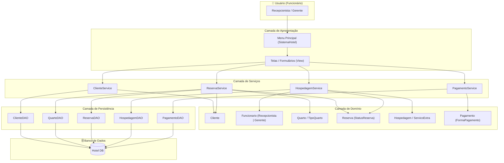

# Diagrama de Componentes UML

O diagrama abaixo representa a estrutura de componentes da arquitetura em camadas, mostrando como cada parte do sistema se comunica.

## Como os componentes se comunicam

O usuário interage apenas com a **camada de apresentação**. Esta delega para os **serviços**, que coordenam as classes de **domínio** e acionam os **DAOs** para persistência. O banco de dados é acessado exclusivamente pela camada de persistência.
