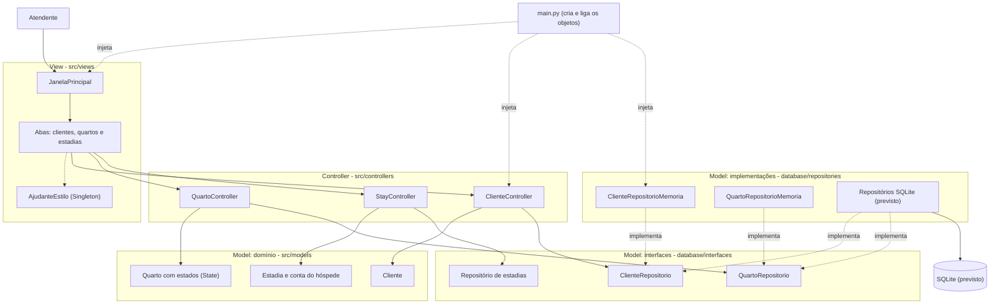

# Diagrama de Componentes

```mermaid
graph TD
    U["Atendente"]
    MAIN["main.py (cria e liga os objetos)"]

    subgraph VIEW["View - src/views"]
        JP["JanelaPrincipal"]
        ABAS["Abas: clientes, quartos e estadias"]
        EST["AjudanteEstilo (Singleton)"]
    end

    subgraph CTRL["Controller - src/controllers"]
        CC["ClienteController"]
        QC["QuartoController"]
        SC["StayController"]
    end

    subgraph DOM["Model: domínio - src/models"]
        CL["Cliente"]
        QU["Quarto com estados (State)"]
        ES["Estadia e conta do hóspede"]
    end

    subgraph INT["Model: interfaces - database/interfaces"]
        ICR["ClienteRepositorio"]
        IQR["QuartoRepositorio"]
        ISR["Repositório de estadias"]
    end

    subgraph IMP["Model: implementações - database/repositories"]
        CRM["ClienteRepositorioMemoria"]
        QRM["QuartoRepositorioMemoria"]
        SQL["Repositórios SQLite (previsto)"]
    end

    DB[("SQLite (previsto)")]

    U --> JP
    JP --> ABAS
    ABAS -.-> EST
    ABAS --> CC
    ABAS --> QC
    ABAS --> SC

    CC --> CL
    QC --> QU
    SC --> ES
    CC --> ICR
    QC --> IQR
    SC --> ISR

    CRM -. implementa .-> ICR
    QRM -. implementa .-> IQR
    SQL -. implementa .-> ICR
    SQL -. implementa .-> IQR
    SQL --> DB

    MAIN -. injeta .-> JP
    MAIN -. injeta .-> CC
    MAIN -. injeta .-> CRM
```
