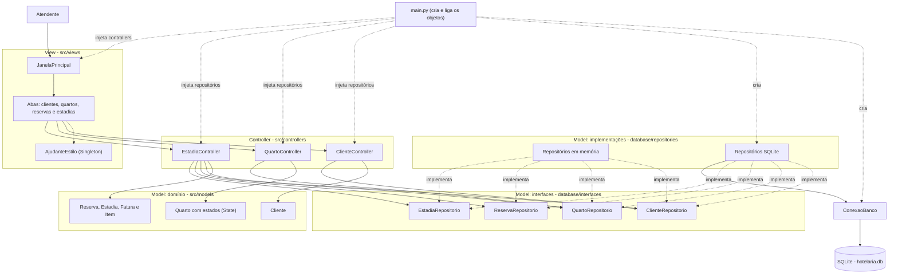

# Diagrama de Componentes

```mermaid
graph TD
    U["Atendente"]
    MAIN["main.py (cria e liga os objetos)"]

    subgraph VIEW["View - src/views"]
        JP["JanelaPrincipal"]
        ABAS["Abas: clientes, quartos, reservas e estadias"]
        EST["AjudanteEstilo (Singleton)"]
    end

    subgraph CTRL["Controller - src/controllers"]
        CC["ClienteController"]
        QC["QuartoController"]
        EC["EstadiaController"]
    end

    subgraph DOM["Model: domínio - src/models"]
        CL["Cliente"]
        QU["Quarto com estados (State)"]
        ES["Reserva, Estadia, Fatura e Item"]
    end

    subgraph INT["Model: interfaces - database/interfaces"]
        ICR["ClienteRepositorio"]
        IQR["QuartoRepositorio"]
        IRR["ReservaRepositorio"]
        IER["EstadiaRepositorio"]
    end

    subgraph IMP["Model: implementações - database/repositories"]
        MEM["Repositórios em memória"]
        SQL["Repositórios SQLite"]
    end

    CON["ConexaoBanco"]
    DB[("SQLite - hotelaria.db")]

    U --> JP
    JP --> ABAS
    ABAS -.-> EST
    ABAS --> CC
    ABAS --> QC
    ABAS --> EC

    CC --> CL
    QC --> QU
    EC --> ES
    CC --> ICR
    QC --> IQR
    EC --> ICR
    EC --> IQR
    EC --> IRR
    EC --> IER

    MEM -. implementa .-> ICR
    MEM -. implementa .-> IQR
    MEM -. implementa .-> IRR
    MEM -. implementa .-> IER
    SQL -. implementa .-> ICR
    SQL -. implementa .-> IQR
    SQL -. implementa .-> IRR
    SQL -. implementa .-> IER
    SQL --> CON
    CON --> DB

    MAIN -. cria .-> CON
    MAIN -. cria .-> SQL
    MAIN -. injeta repositórios .-> CC
    MAIN -. injeta repositórios .-> QC
    MAIN -. injeta repositórios .-> EC
    MAIN -. injeta controllers .-> JP
```
